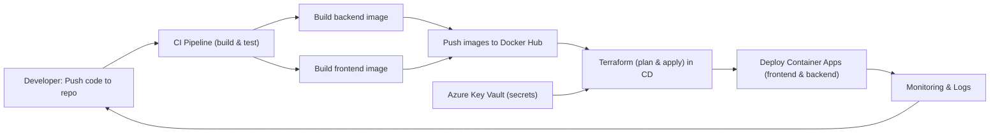

# Despliegue Escalable de un Microservicio en una Arquitectura Cloud con Terraform

Este repositorio contiene una solución completa de arquitectura cloud serverless que incluye un microservicio backend, un frontend estático y configuración de infraestructura como código (IaC) usando Terraform.

**Versión: 1.0**

## 📁 Estructura del Repositorio

```
dmc-devops-iac/
├── code_back/                  # Microservicio backend (Spring Boot)
│   ├── src/
│   │   └── main/java/com/example/saludo/
│   │       ├── SaludoApplication.java
│   │       └── controller/
│   │           └── SaludoController.java
│   ├── pom.xml                 # Dependencias Maven
│   ├── Dockerfile              # Multi-stage build (Maven + JRE)
│   └── README.md
├── code_front/                 # Frontend estático (HTML + CSS + JS)
│   ├── index.html              # Página principal
│   ├── styles.css              # Estilos
│   ├── config.js               # Configuración dinámica
│   ├── start.sh                # Script de arranque
│   ├── Dockerfile              # Nginx alpine
│   ├── .dockerignore           # Archivos a ignorar en build
│   └── README.md
├── infrastructure/             # Configuración Terraform
│   ├── provider.tf             # Proveedor Azure
│   ├── variables.tf            # Variables de entrada
│   ├── terraform.tfvars        # Valores de variables
│   ├── resource_group.tf       # Grupo de recursos
│   ├── container_app_env.tf    # Container Apps (backend + frontend)
│   ├── azure_files.tf          # Azure Files para almacenamiento
│   └── README.md
└── README.md                   # Este archivo
```

---

## 🚀 Backend (code_back)

### Descripción
Microservicio Spring Boot que expone dos endpoints REST:

### Endpoints
- **GET `/saludo`**
  - Retorna: `"Hola Mundo desde Docker"`
  - Propósito: Verificar que el servicio está activo

- **GET `/mostrar_secreto`**
  - Retorna: Valor de la variable de entorno `KEYVAULT_VALUE`
  - Propósito: Obtener secretos desde Azure Key Vault (u otra fuente)
  - Fallback: Si no está configurada, retorna mensaje de error

### Características
- ✅ CORS habilitado (`@CrossOrigin(origins = "*")`)
- ✅ Ejecuta en puerto `8080`
- ✅ Dockerfile multi-stage (Maven builder + JRE runtime)

### Tecnologías
- Java 21
- Spring Boot 3.x
- Maven

### Build Local
```bash
cd code_back
mvn clean package
java -jar target/saludo-service-0.0.1-SNAPSHOT.jar
```

### Docker Local
```bash
cd code_back
docker build -t app-back-saludo:latest .
docker run -d -p 8080:8080 \
  -e KEYVAULT_VALUE="tu-secreto" \
  --name app-back-saludo-01 \
  app-back-saludo:latest
```

---

## 🎨 Frontend (code_front)

### Descripción
Aplicación HTML estática servida por Nginx que consume los endpoints del backend.

### Estructura
```
index.html      → Página principal con título, subtítulo y controles
styles.css      → Estilos CSS (separado en archivo externo)
config.js       → Configuración dinámica de la URL del backend
start.sh        → Script que genera config.js e inicia Nginx
```

### Características
- ✅ Interfaz responsiva con estilos modernos
- ✅ Subtítulo que carga automáticamente el servicio `/saludo`
- ✅ Botón "Mostrar secreto" que consume `/mostrar_secreto`
- ✅ Caja de salida para mostrar respuestas
- ✅ Footer con autoría
- ✅ Configuración dinámica de URL del backend
- ✅ Nginx Alpine para imagen ligera

### Configuración Dinámica
El archivo `config.js` se genera dinámicamente al iniciar el contenedor:

```javascript
window.apiConfig = {
    apiBaseUrl: 'http://backend-url:8080',  // Inyectado desde BACKEND_URL
    endpoints: {
        saludo: '/saludo',
        mostrarSecreto: '/mostrar_secreto'
    }
};
```

La variable `BACKEND_URL` se inyecta desde:
- **Local**: Manually en `docker run -e BACKEND_URL=...`
- **Azure**: Terraform inyecta `https://<backend-fqdn>`

### Docker Local
```bash
cd code_front
docker build -t code-front-saludo:latest .

# Sin variable de entorno (usa localhost:8080)
docker run -d -p 8081:80 --name app-front-saludo-01 code-front-saludo:latest

# Con variable de entorno personalizada
docker run -d -p 8081:80 \
  -e BACKEND_URL="http://localhost:8080" \
  --name app-front-saludo-01 \
  code-front-saludo:latest
```

Accede a: **http://localhost:8081**

---

## 🏗️ Infraestructura (infrastructure)

### Descripción
Configuración de infraestructura como código (IaC) usando Terraform para desplegar en Azure Container Apps.

### Componentes Principales

#### `provider.tf`
- Proveedor Azure Resource Manager
- Versión de Terraform requerida

#### `variables.tf`
Variables de entrada:
- `location`: Región de Azure (ej: "East US 2")
- `tags`: Etiquetas para recursos
- `rg_01_name`: Nombre del Resource Group
- `backend_image`: URL de imagen Docker del backend
- `frontend_image`: URL de imagen Docker del frontend
- `backend_name`: Nombre del Container App (backend)
- `frontend_name`: Nombre del Container App (frontend)

#### `terraform.tfvars`
Valores específicos para tu entorno:
```hcl
location = "East US 2"
rg_01_name = "rg-mjllanos-dev-eastus2-001"
backend_image = "mjllanosc/app-back-saludo-01:v1.0"
frontend_image = "mjllanosc/app-front-saludo-01:v1.0"
```

#### `resource_group.tf`
- Crea/gestiona Resource Group en Azure

#### `container_app_env.tf`
**Backend Container App:**
- Imagen: `mjllanosc/app-back-saludo-01:v1.0`
- Puerto: `8080`
- Variables de entorno: `PORT=8080`
- Nota: `KEYVAULT_VALUE` debe ser inyectada desde Azure Key Vault o secrets

**Frontend Container App:**
- Imagen: configurable
- Puerto: `80` (Nginx)
- Variable de entorno: `BACKEND_URL=https://<backend-fqdn>`
- Comunicación automática con el backend

#### `azure_files.tf`
- Storage Account para datos persistentes
- Azure Files compartido

### Workflow Terraform

```bash
cd infrastructure

# Inicializar (descargar proveedores)
terraform init

# Validar configuración
terraform validate

# Ver cambios que se harán
terraform plan

# Aplicar cambios en Azure
terraform apply

# Destruir recursos (cuidado!)
terraform destroy
```

---

## 🔐 Variables de Entorno

### Backend
| Variable | Uso | Origen |
|---|---|---|
| `PORT` | Puerto del servicio Spring Boot | Terraform |
| `KEYVAULT_VALUE` | Secreto a devolver en `/mostrar_secreto` | Azure Key Vault (por configurar) |

### Frontend
| Variable | Uso | Origen |
|---|---|---|
| `BACKEND_URL` | URL base para APIs del backend | Terraform (genera config.js) |

---

## 🌐 Flujo de Comunicación

### Local (Docker)
```
Usuario (http://localhost:8081)
    ↓
Frontend (Nginx en puerto 8081)
    ↓
Backend (http://localhost:8080)
    ↓
Endpoints: /saludo, /mostrar_secreto
```

### Azure Container Apps
```
Usuario (https://ca-frontend-saludo.azurecontainerapps.io)
    ↓
Frontend (Nginx)
    ↓
Backend (DNS interno de Container App Environment)
    ↓
Endpoints: /saludo, /mostrar_secreto
```

---

## 📋 Requisitos

### Local
- Docker & Docker Compose
- Java 21+ (para compilar backend manualmente)
- Maven 3.9+
- Git

### Azure
- Cuenta de Azure con permisos
- Azure CLI (`az login`)
- Terraform 1.0+

---

## 🚀 Guía Rápida de Inicio

### 1️⃣ Ejecutar Local con Docker

**Terminal 1: Backend**
```bash
cd code_back
docker build -t app-back-saludo:latest .
docker run -d -p 8080:8080 \
  -e KEYVAULT_VALUE="mi-secreto-local" \
  --name backend \
  app-back-saludo:latest
```

**Terminal 2: Frontend**
```bash
cd code_front
docker build -t code-front-saludo:latest .
docker run -d -p 8081:80 \
  -e BACKEND_URL="http://localhost:8080" \
  --name frontend \
  code-front-saludo:latest
```

**Acceder:**
- Frontend: http://localhost:8081
- Backend: http://localhost:8080/saludo

### 2️⃣ Desplegar en Azure

```bash
# Configura credenciales
az login

# Navega a infraestructura
cd infrastructure

# Actualiza terraform.tfvars con tus valores
# - Imágenes Docker en Docker Hub
# - Nombres únicos de recursos

# Desplega
terraform init
terraform plan
terraform apply
```

---

## 🔧 Configuración de Azure Key Vault (Próximo Paso)

Para inyectar la variable `KEYVAULT_VALUE` desde Azure Key Vault:

1. Crear Key Vault en Azure
2. Agregar secreto `KEYVAULT_VALUE`
3. Configurar Managed Identity en Container App
4. Actualizar Terraform para read secreto desde Key Vault

---

## 📝 Notas Importantes

- ✅ CORS está habilitado en el backend para desarrollo
- ✅ El frontend usa configuración dinámica, adecuada para CI/CD
- ✅ Dockerfile multi-stage reduce tamaño de imagen del backend
- ✅ Nginx Alpine proporciona imagen ligera para frontend
- ⚠️ `allow_insecure_connections = true` en Terraform permite HTTP (cambiar a HTTPS en producción)

---

## 🔐 Integración de Key Vault, identidad y storage (según estructura actual)

En la versión 1.0 la infraestructura incluye soporte para secretos y almacenamiento según la estructura descrita arriba:

- `azurerm_user_assigned_identity.identity_01`: identidad asignada por usuario para que el backend pueda autenticar contra Key Vault.
- `azurerm_key_vault.kv_01` y `azurerm_key_vault_secret.keyvault_secret`: Key Vault con el secreto `KEYVAULT-VALUE` (valor definido en `terraform.tfvars` o inyectado por CI/CD).
- `azurerm_storage_account.st_01` y `azurerm_storage_share.share_01`: Storage Account y Azure Files para necesidades de almacenamiento.
- El `azurerm_container_app.backend` está configurado con `identity { type = "UserAssigned" ... }` y la variable de entorno `KEYVAULT_VALUE` toma el valor del secreto.
- `outputs.tf` expone `backend_fqdn`, `frontend_fqdn`, `keyvault_name`, `user_identity_id` y URLs útiles para pruebas.

### Variables relacionadas (en `infrastructure/variables.tf`)
- `identity_01_name`
- `kv_01_name`
- `kv_secret_value` (sensitive)

Usa `terraform output` después del despliegue para obtener las URLs y los IDs necesarios para integración y pruebas.

---

## CI/CD — Diagrama del flujo (Mermaid)



Descripción del flujo:

- El desarrollador hace push al repositorio.
- El pipeline CI construye las imágenes del backend y frontend y ejecuta pruebas.
- Las imágenes se publican en Docker Hub.
- El pipeline CD ejecuta `terraform plan` y `terraform apply`, usando las imágenes publicadas y leyendo secretos desde Key Vault cuando procede.
- Terraform despliega/actualiza los Azure Container Apps con la Managed Identity ligada al backend y con `BACKEND_URL` inyectado al frontend.
- Monitorización y logs permiten cerrar el ciclo y notificar al desarrollador.


## 👤 Autor

**Merwin Johel Llanos Cueva** ([@mjllanosc](https://github.com/mjllanosc))

---

## 📄 Licencia

Proyecto de demostración para arquitectura cloud serverless con Terraform.

---

## 🤝 Contribuciones

Para mejoras, abre un issue o PR.

---

## 📞 Soporte

Consulta los README individuales:
- [code_back/README.md](code_back/README.md)
- [code_front/README.md](code_front/README.md)
- [infrastructure/README.md](infrastructure/README.md)
